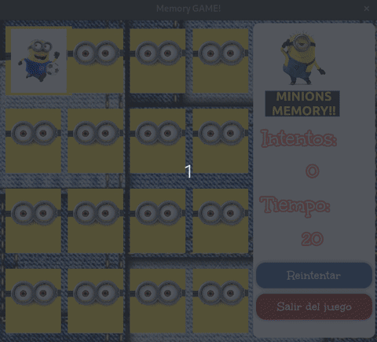

# 🃏 Memory Card Game 🎮

¡Bienvenido al Memory Card Game! Un clásico juego de cartas de memoria implementado en Java usando JavaFX para la interfaz gráfica. El objetivo del juego es emparejar las cartas lo más rápido posible.

## ⬇️ Descargar y jugar (sin instalar Java)

👉 **[Última release con instaladores](https://github.com/javilesaca/memoryCard/releases/latest)**

| Sistema | Archivo |
|---|---|
| Windows | `memory-card-1.0.1.exe` |
| macOS | `memory-card-1.0.1.dmg` |
| Linux | `memory-card_1.0.1_amd64.deb` |

Cada instalador lleva el runtime Java 21 empaquetado: doble clic y a jugar.

## 🎬 Demo



## 🖥️ Tecnologías Utilizadas

Java y JavaFX para la lógica y la interfaz gráfica.

CSS para el diseño y estilo de la interfaz.

---

## 🚀 Instrucciones para ejecutar el juego

Clonar el repositorio:

```bash
git clone https://github.com/javilesaca/memoryCard.git
```

Navegar al directorio del proyecto:

```bash
cd memoryCard
```

Ejecutar el proyecto en un entorno Java compatible con JavaFX. Si estás usando IntelliJ IDEA o Eclipse, solo debes ejecutar el archivo ```Principal.java```.

---

## 🤝 Contribuciones

¡Las contribuciones son bienvenidas! Si tienes ideas para mejorar el juego o has encontrado un error, siéntete libre de abrir un issue o enviar un pull request.

---

## 📝 Licencia

Este proyecto está licenciado bajo la MIT License.

---

# 🌐 Versión Web Disponible

¡Ahora también puedes jugar al Memory Card Game directamente desde tu navegador con estilo arcade clásico y tecnología web moderna!
La versión web ha sido desarrollada con:

HTML5, CSS3 (Grid + efecto glow retro) y JavaScript ES6+ sin bundler — [repo web](https://github.com/javilesaca/memorycard-web)

Firebase Firestore como backend para almacenamiento de puntuaciones y ranking (migrado desde Supabase, cuyo plan gratuito pausaba la BD por inactividad), con fallback a localStorage

Diseño responsive para jugar desde cualquier dispositivo

Ranking online y sistema de iniciales tipo arcade para registrar tu puntuación

👉 Juega ahora: https://javilesaca.pro/memoryCard/


